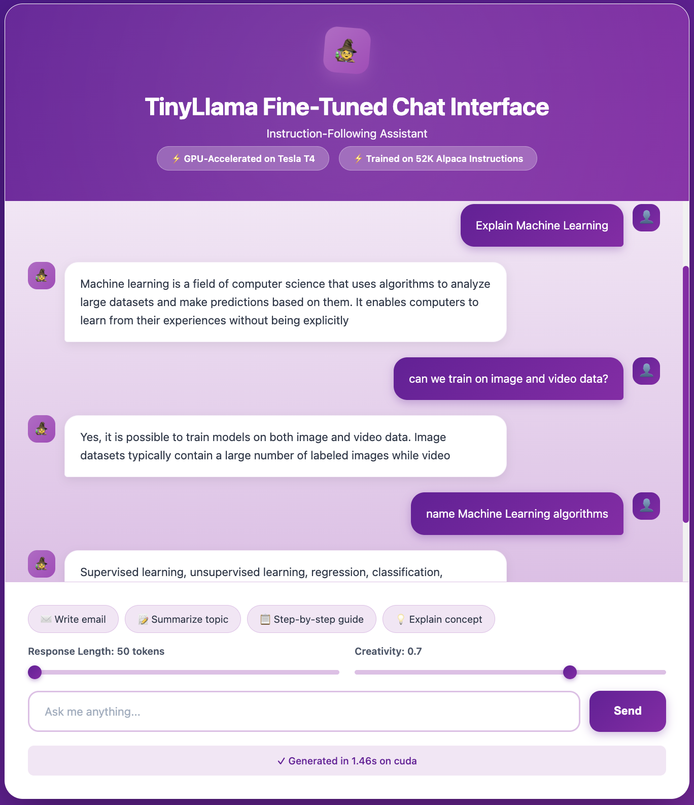

# Fine-Tuning LLM with Kubernetes

An end-to-end production-grade pipeline for fine-tuning Large Language Models (LLMs) 
using Kubernetes orchestration, demonstrating modern MLOps practices with GPU infrastructure.

---
<div align="center">
  
  
  
  
</div>

## Project Overview

This project showcases how to fine-tune TinyLlama (1.1B parameters) into an instruction-following 
chat model using the Alpaca dataset, all orchestrated through Kubernetes on AWS GPU instances. 
The pipeline demonstrates memory-efficient fine-tuning with QLoRA (Quantized Low-Rank Adaptation) 
while keeping inference services running concurrently.

## Model Comparison: Base vs Fine-Tuned

The fine-tuned model demonstrates significant improvements in instruction-following, structured output, and task completion quality. Below are side-by-side comparisons showing the difference in performance.

<table>
<tr>
<td width="50%">

#### Base Model (CPU)


*The base model provides a conversational explanation but lacks structure and may include unnecessary details or go off-topic.*

</td>
<td width="50%">

#### Fine-Tuned Model (GPU)


*The fine-tuned model delivers a clear, concise explanation with better organization and stays focused on the topic.*

</td>
</tr>
</table>

## Key Features

- **GPU-Accelerated Training**: Leverage NVIDIA Tesla T4 GPUs through Kubernetes for efficient model training
- **Memory-Efficient Fine-Tuning**: Implement QLoRA (4-bit quantization + LoRA adapters) to reduce GPU memory requirements by 75%
- **Production Infrastructure**: Deployed Kubernetes cluster on AWS using Kubespray with proper GPU support (NVIDIA device plugin, RuntimeClass)
- **Concurrent Operations**: Run fine-tuning jobs alongside live inference services on the same GPU
- **Containerized Workflows**: Fully Dockerized training and inference pipelines
- **Checkpoint Recovery**: Resume training after interruptions using AWS EBS
- **A/B Testing Ready**: Compare base model vs fine-tuned model performance side-by-side
- **GitOps Workflow**: Version-controlled infrastructure and configurations, datasets, and hyperparameters

## Architecture

Transform a base language model into a conversational AI through Kubernetes-orchestrated training:


***Training Pipeline***: TinyLlama-1.1B → [QLoRA + Alpaca Dataset] → Fine-tuned Model → HuggingFace Hub

### Technology Stack

| Component | Technology |
|-----------|------------|
| **Compute** | AWS G4DN (Tesla T4 GPU) |
| **Orchestration** | Kubernetes 1.28+ (Kubespray) |
| **Container Runtime** | containerd with NVIDIA runtime |
| **ML Framework** | PyTorch 2.0+, Transformers 4.35+ |
| **Fine-Tuning** | PEFT (QLoRA), 4-bit quantization |
| **Backend** | FastAPI, Uvicorn |
| **Frontend** | HTML/CSS/JS, Nginx |
| **Storage** | AWS EBS (gp3) |
| **Registry** | GitHub Container Registry |

## Repository Structure


## Quick Start

### Step 1: Clone Repository
```bash
git clone https://github.com/yourusername/finetuning-llm-with-k8s.git
cd finetuning-llm-with-k8s
```

### Step 2: Configure AWS Connection
Edit `infrastructure/setup_aws_node.sh` with your instance details:

```bash
PUBLIC_IP="YOUR_AWS_PUBLIC_IP"       # e.g., "54.123.45.67"
PRIVATE_IP="YOUR_AWS_PRIVATE_IP"     # e.g., "172.31.0.10"
SSH_KEY_PATH="~/.ssh/your-key.pem"   # Path to your SSH key
SSH_USER="ubuntu"                     # SSH username
```

### Step 3: Deploy Kubernetes Cluster
```bash
# Make scripts executable
chmod +x infrastructure/*.sh

# Run automated setup (takes ~30-45 minutes)
./infrastructure/setup_aws_node.sh
```

This script will:
1. Install Kubespray and dependencies
2. Deploy Kubernetes to your AWS instance
3. Configure GPU support (NVIDIA device plugin)
4. Set up kubectl on your local machine
5. Verify cluster health

### Step 4: Create Persistent Storage (skip if you're not training/fine-tuning model, go to step 7)
```bash
# Create directory on AWS instance
ssh -i ~/.ssh/your-key.pem ubuntu@YOUR_PUBLIC_IP "sudo mkdir -p /mnt/fast-disks/models && sudo chmod 777 /mnt/fast-disks/models"

# Deploy PersistentVolume
kubectl apply -f k8s-manifests/training-instruction-fintune/models-pv.yaml

# Verify
kubectl get pv
```

### Step 5: Configure Hugging Face Credentials
```bash
# Get your token from https://huggingface.co/settings/tokens
kubectl create secret generic huggingface-token \
  --from-literal=token='hf_YOUR_ACTUAL_TOKEN' \
  --from-literal=repo='your-username/tinyllama-alpaca-finetuned'
```

### Step 6: Launch Training Job
```bash
# Deploy training job
kubectl apply -f k8s-manifests/training-instruction-fintune/training-job.yaml

# Monitor progress
kubectl logs -f job/tinyllama-finetune-alpaca
```

### Step 7: Deploy Inference Services

#### Deploy Base Model
```bash
kubectl apply -f k8s-manifests/inference-base/
```

#### Deploy Fine-Tuned Model (after training completes)
```bash
kubectl apply -f k8s-manifests/inference-finetuned/
```

### Step 8: Access Services

```bash
# Get NodePort for services
kubectl get svc

# Example output:
# llm-api-finetuned-service   NodePort   10.96.1.1   <none>   80:30557/TCP
# llm-api-service    NodePort   10.96.1.2   <none>   80:31234/TCP
```

Add the service ports to AWS security group

Update The API_PORT variable in `k8s-manifests/ui-base/configmap.yaml` on line 214 with the NodePort from the llm-api-service
Update The API_PORT variable in `k8s-manifests/ui-finetuned/configmap.yaml` on line 221 with the NodePort from the llm-api-finetuned-service

### Step 9: Deploy Web UIs
```bash
# Base model UI
kubectl apply -f k8s-manifests/ui-base/

# Fine-tuned model UI
kubectl apply -f k8s-manifests/ui-finetuned/
```

### Step 10: Access Services

```bash
# Get NodePort for services
kubectl get svc

# Example output:
# llm-api-finetuned-service   NodePort   10.96.1.1   <none>   80:30557/TCP
# llm-api-service    NodePort   10.96.1.2   <none>   80:31234/TCP
# llm-ui-finetuned-service   NodePort   10.96.1.1   <none>   80:30211/TCP
# llm-ui-service    NodePort   10.96.1.2   <none>   80:31211/TCP
```

Add the service ports to AWS security group

Access in browser:
- **Fine-tuned API**: `http://YOUR_PUBLIC_IP:30211`
- **Fine-tuned UI**: `http://YOUR_PUBLIC_IP:31211`

Fine-tuned Model: `https://huggingface.co/shettynavisha25/tinyllama-alpaca-finetuned`

## Acknowledgments

- **TinyLlama Team** - For the base model
- **Stanford Alpaca** - For the instruction dataset
- **Hugging Face** - For Transformers and PEFT libraries
- **NVIDIA** - For GPU computing and container toolkit
- **Kubernetes Community** - For orchestration platform

## Additional Resources

- [TinyLlama Model Card](https://huggingface.co/TinyLlama/TinyLlama-1.1B-Chat-v1.0)
- [QLoRA Paper](https://arxiv.org/abs/2305.14314)
- [Alpaca Dataset](https://github.com/tatsu-lab/stanford_alpaca)
- [Kubernetes GPU Support](https://kubernetes.io/docs/tasks/manage-gpus/scheduling-gpus/)
- [PEFT Documentation](https://huggingface.co/docs/peft)
